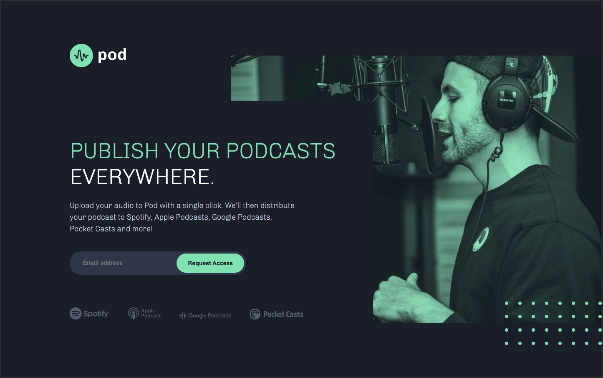
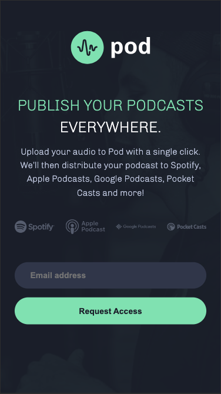

# Frontend Mentor - Pod request access landing page

## The challenge

The challenge is to build out this early access landing page and get it looking as close to the design as possible.

Users should be able to:

- View the optimal layout depending on their device's screen size
- See hover states for interactive elements
- Receive an error message when the form is submitted if:
  - The `Email address` field is empty should show "Oops! Please add your email"
  - The email is not formatted correctly should show "Oops! Please check your email"

## Where to find everything

All the required assets for this project are in the `/assets` folder. The assets are already exported for the correct screen size and optimized. Some images are reusable at multiple screen sizes. So if you don't see an image in a specific folder, it will typically be in another folder for that page.

### Screenshots

#### Desktop:

  

#### Tablet

  

#### Mobile:

  

#### Active states:

  

### Built with

- Semantic HTML5 markup
- CSS custom properties
- Flex
- Media queries
- JavaScript DOM-manipulations
- Visual Studio Code
